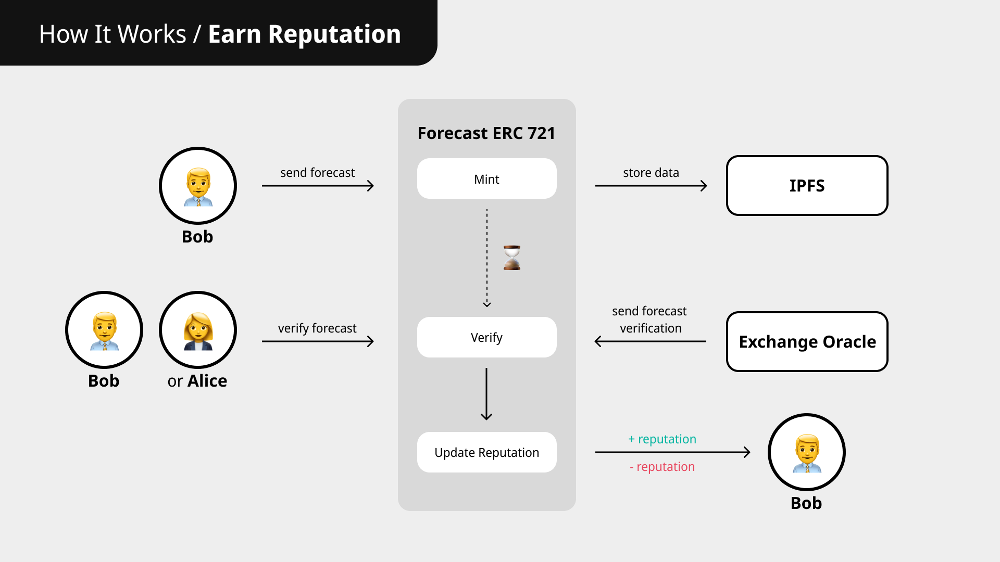
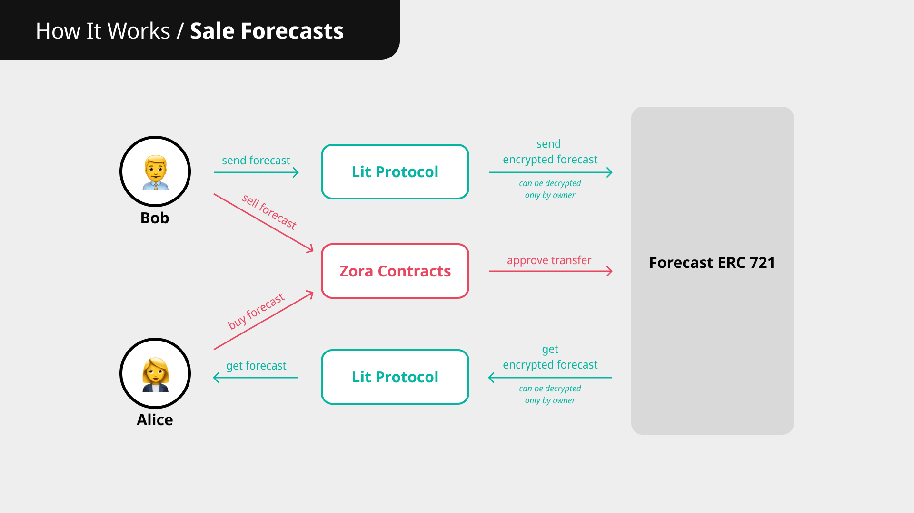

# TradeRep App

A decentrilized application that helps investors and beginners save money and time by filtering good traders from scammers with a reputation verified by blockchain

🔗 Link - https://traderep.space

## How it works

## Project repositories

- App - https://github.com/traderep-space/app
- Contracts - https://github.com/traderep-space/contracts
- Subgraph - https://github.com/traderep-space/subgraph

## Stack

- IPFS (Web3.Storage)
- TypeScript
- Next.js
- MUI
- ethers.js
- Solidity Smart Contracts
- The Graph
- Zora (https://zora.co/)
- Lit Protocol (https://litprotocol.com/)
- Vercel

## Commands

- Install depencies - `npm install`
- Start development server - `npm run dev`
- Run production build - `npm run build` and `npm run start`
- Deploy to Vercel - `vercel`
- Deploy to production on Vercel - `vercel --prod`
